# Paper Weight

[Link to deployed site](https://paper-weight.herokuapp.com/)

## Introduction

Paper Weight is a full-stack Django website built using Python, Javascript, HTML and CSS. This web application is a full B2C e-commerce website for a fictional online stationery store. 

The site provides role based permissions for users to interact with a central dataset. It includes user authentication, email validation, full CRUD functionality for both users and admin users.

The users of the site can browse all products at once, filter specfic categories and search for a specific item. The search bar uses keyword searches so it will show the user a product if the desicription contains the word they were searching.

When a user finds a product that they want, they are able to click on the product image which will direct them to a page on the site which gives them more detail about the specific problem. They can decide to add it into their bag, with the ability of picking the quantity of the item or simply return to all the products. If the user decides later on that they want to change the quantity of the product they have selected they can either change it on the product detail page of from their shopping bag. 

At the checkout, the user will be prompted with a form in order to complete their transaction. If they are an authenticated user then they have an option to save their delivery info for more efficient future checkouts. The user can access any information they have submitted by going to their profile and from their they can update any incorrect information. When the purchase has successfully gone through, the user will recieve a email confirming their purchase, they will also recieve confirmation on the website and are able to see an order history on the profile page.

The payment system uses Stripe. (Please note this website is for eductional purposes only and the credit card payment functionality is not set up to take real payments.) When testing interactively, using the numbers 4242... for everyting will allow the payment to go through as it is a practice card.

## Ideal User Demographic 

### The ideal users of this website are:
- Gift givers
- Kids going back to school 
- Aspiring Artists
- People who are supplying at school/office etc. with stationery

#### Target Audience
- Demographics:
    - Children
    - Artists 
    - Office workers 
    - School teachers

## User Experience

### User Stories 

22 user stories were created while planning this project and out of those, 20 of them were completed (The other 2 that wasn't completed was either due to running out of time or my project changed as it developed and that user story was no longer needed).

As a **Site User** :

- Register for an account so that log in, get and modify my profile and see my orders.
-  Log in and out so that I can access my personal information, shop, and keep my details secure.
- Reset my password so that I can keep my account secure and regain access to my account if I forgot the password.
- Receive a confirmation email when registering so that I can verify my registration to the site was successful.
- Access a specific product so that I can review the details and price.
- Have a shopping bag so that I can see how much my selected products come to.
- Access my profile details so that I can see what personal information is stored.
- Change any details on my profile so that I can keep my personal information up to date.
- Easily access my order history so that I am aware of past purchases.
- Decide whether I want to opt-in for emails from the website so that I can change mind if I change my mind
- Add items I like to a shopping bag so that purchase multiple items at once.
- View a list of products so that I can see what products I want to buy.
- Save my card details so that it helps make future purchases easier.
- Categorise my searches so that I can find products suited better to my needs.
- Search for products so that I can easily access a specific product with ease.
- Make secure products so that safely order and receive any products I choose to buy.
- See reviews that other customers have left so that find out about the quality of a product before purchasing. (Not other customers as I didn't have time to implement it but the users can see blogs that the Admins have posted and are able to comment on them.)
- Select a size and a quantity of a product so that I can be sure I have enough of that selected product in my bag. (This user story was no longer needed due to my project changing direction of what it would sell.)
- Leave a review on a product so that I can voice my opinion on the product for other users to see. (I ran out of time to implement this one. This would be something I would work on in the future.)

As an **Admin**:
- Access a specific product so that I can review the details and price.
-  Alter the details of products so that I can keep the information up to date
- Select what type of products I want to sell so that provide more choices for my customers.
- Add/remove products so that I can change the products I am selling to my customers.
- Search for products so that I can easily access a specific product with ease.

#### Overall Project Goals 
- To provide users different functionalities, such as product purchase and user authentication with secure payments.
- The site owner to have the ability to manage the site to update products and keep users updated on what is going on with the store through the use of blogs.

## Website Architecture 

A relational database has been used to deliver the expected functionality. SQLite was used in development of the site and Postgres provided by the Heroku platform is being used in production. I have created a diagram which shows the database models and the relationships between them. 

As well as creating similar models to the boutique ado walkthrough project provided to us by Code Institute, we were required to make custom models. I created Post, Comment and Contact.

The Post model is responsible for handling the fields of each blog post, the Comment model is responsible for the fields for each comment. The Contact model is repsponsible for handling the submission form that users can do if they need to contact the site owners.

## Wireframes 

My end product of the website wasn't altered much from my initial designs. The checkout and products pages are heavily inspired by the boutique ado project with a few altercations. My home page is full of colour. this site targets a wide range of ages but speficially it is more aimed at children so the bursts of colour on the home page is necessary. 

### Index wireframes

The index page greets users with featured products chosen by the site owners. As they scroll down they come across another section of the website which is divided into 4 groups: All products, pens, paper and school supplies. The user may click on them and it will navigate them to that specific group of products.

### Products wireframe

The products page is quite simple. It features rows and rows of products which users can categorize and narrow down their searches. The site owner can edit and delete products from this page as well.  

### Checkout wireframe

The checkout page is again very simple which helps for an easy and efficient checkout. Th product images are featured on the left hand side and all the information about the product, the quantity and the total on the product/s are to the right of the images. On the bottom right shows the delivery charges and the total charges overall.

## Features 

### Home Page

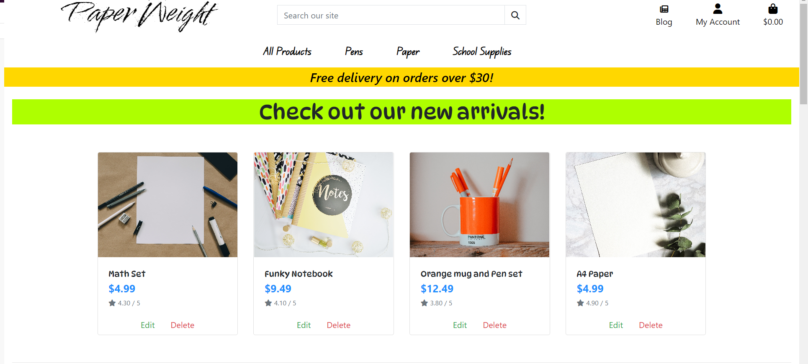

### Footer 

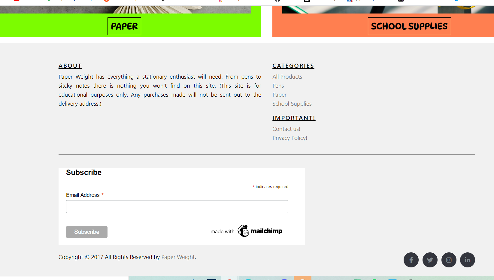

### Products

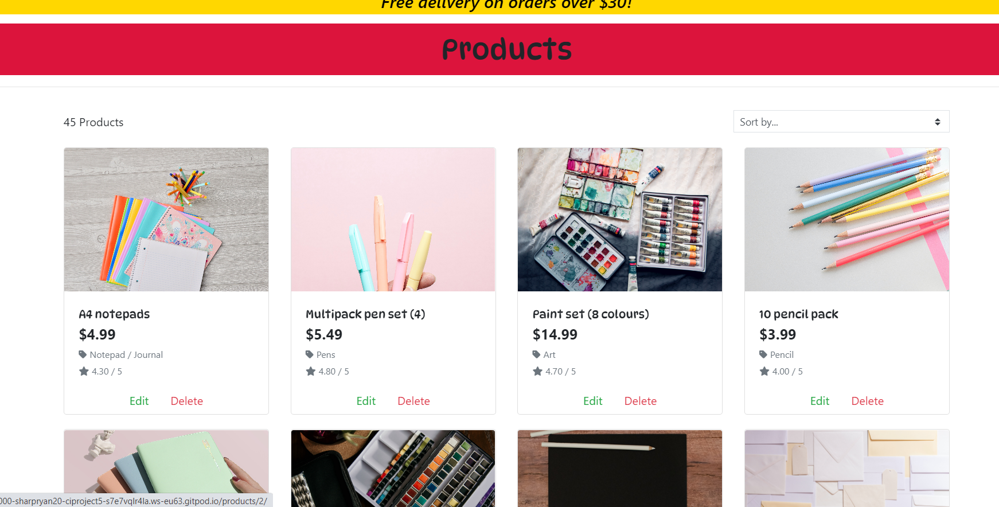

### Products Detail

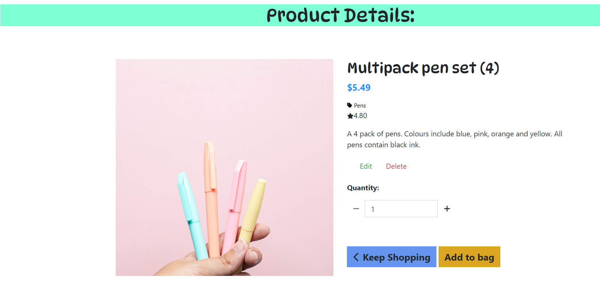

### Bag 

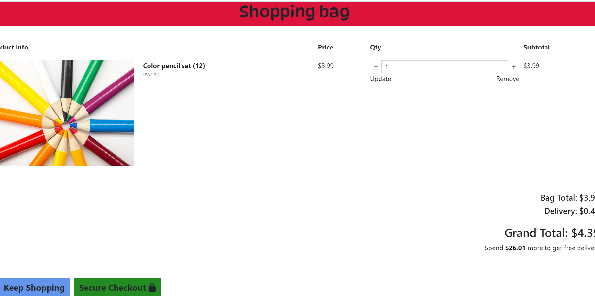

### Checkout 

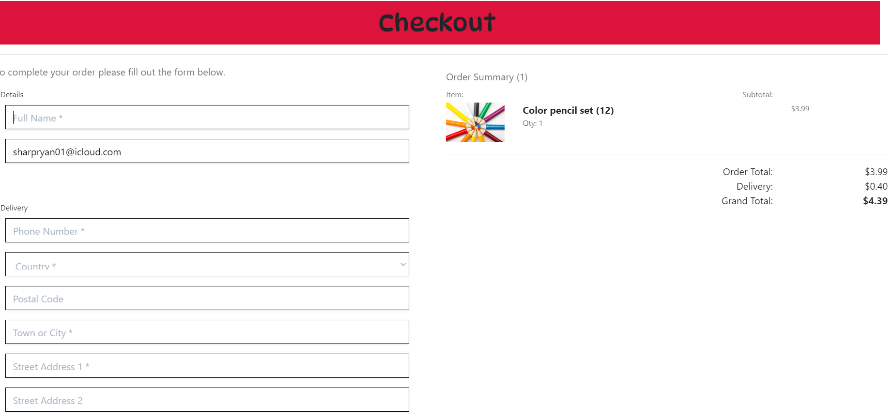

### Blog

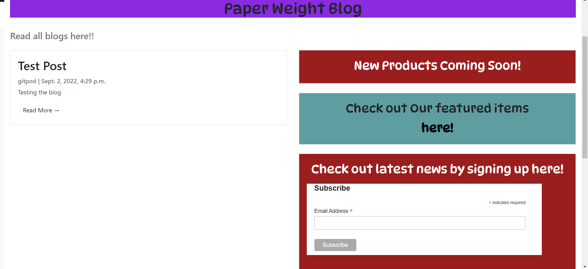

### Blog Details

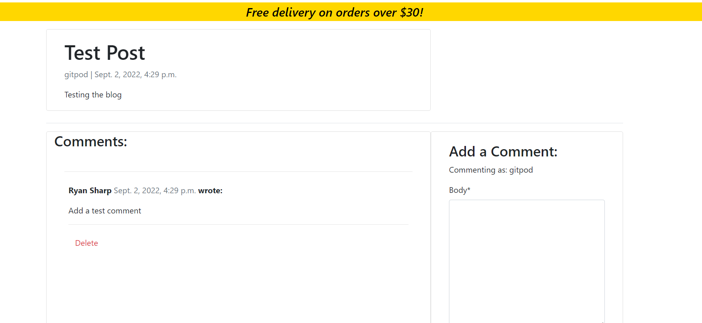

### Order Confirmation

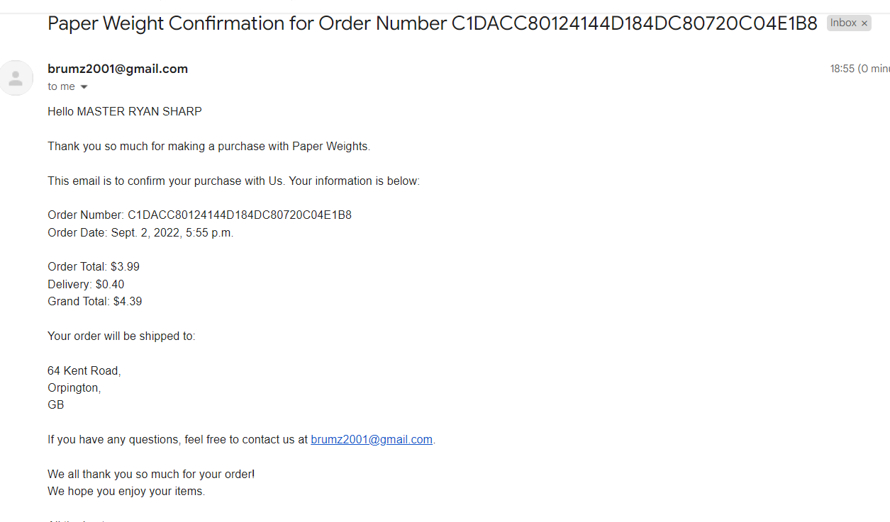

## Web Marketing

As part of the Code Institue assessment criteria, a facebook page was created to promote the company. Here is an screenshot of the page.

## Future expectations

In the future I plan on implementing a lot of new features to the website such as;

- The ability for a User to create their own blog and delete their own comments when made on another blog.

- A wishlist function so users can add products they wish to buy at a later date.

- The ability for a user to rate their purchases which contributes to the products overall ratings.

- The ability for site owners to add, edit and delete blogs without having to go to the admin panel.

## Testing 

These are some PEP8 python validation screenshots:

- Bag.views Check
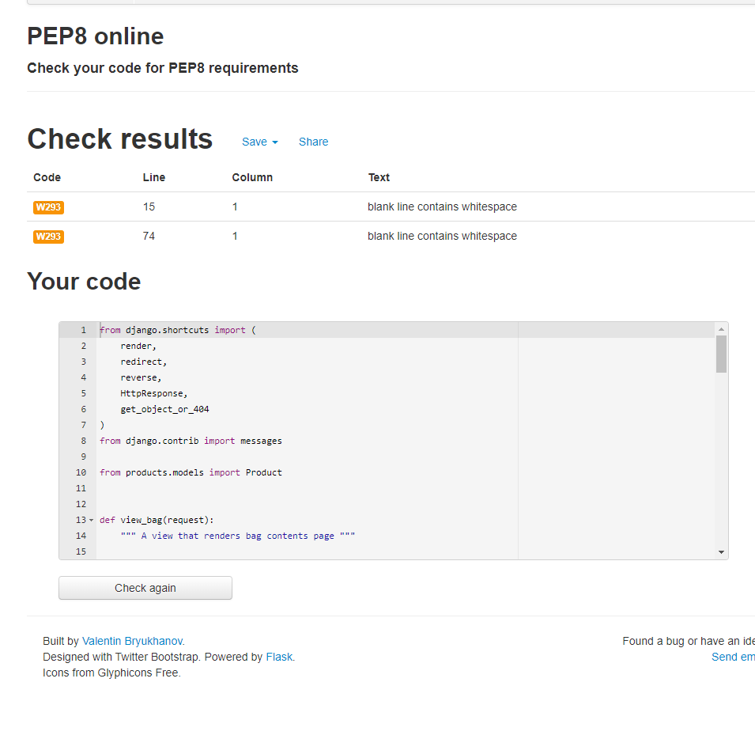

- Blog.admin check
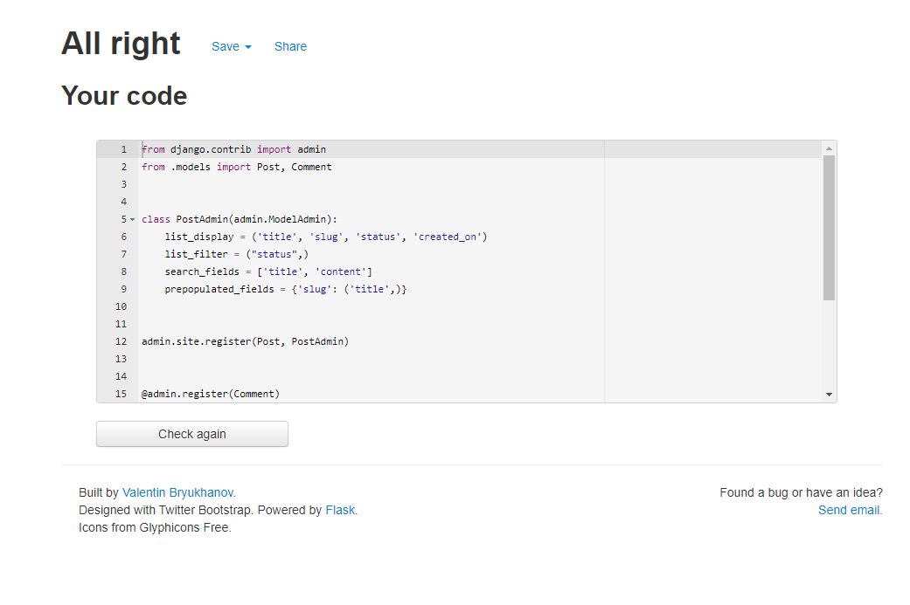

- Products.models check
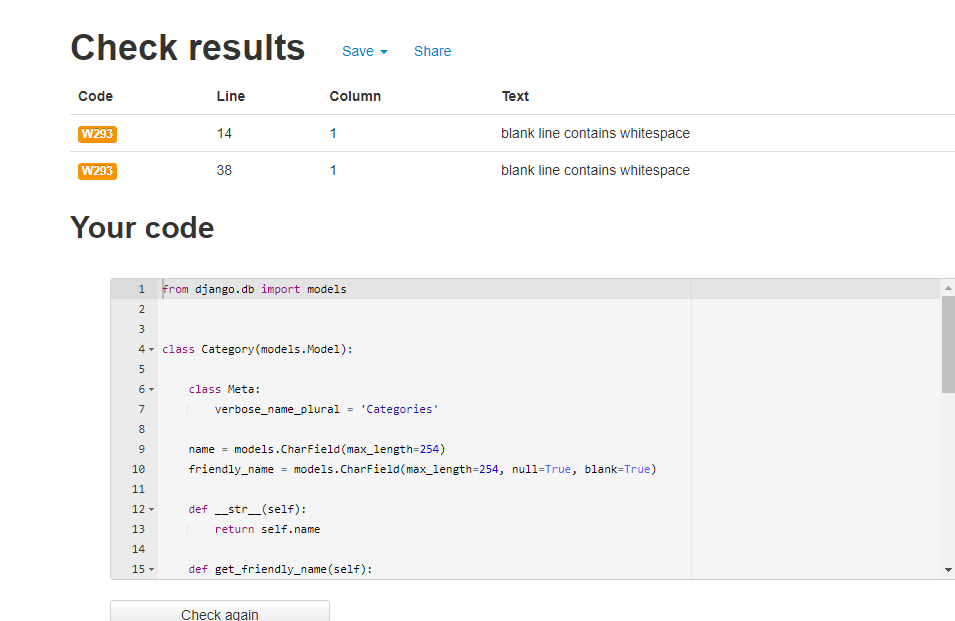

This is a screenshot of my lighthouse report for the home page:

### Manual Testing 

## Technologies Used 

### Languages and Frameworks

 The following programming languages and frameworks were used in the development of this project:
- Python:
The following python packages were used throughout the project.
    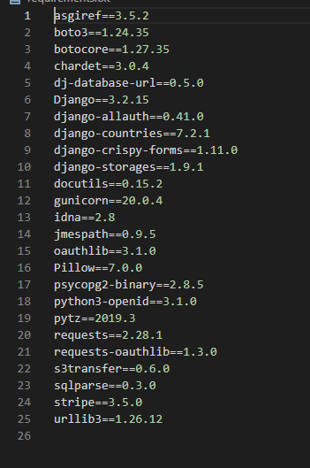

- Django: 
Django was used as the primary Python framework for this project.
Django's authentication library; allauth, was used to implement user account authentication.

- Heroku:
Heroku is the cloud based platform used to deploy this website and make it public.

- Heroku PostgreSQL:
Heroku PostgreSQL was used as the database choice for this project during development.

- JavaScript & JQuery:
Vanilla JS & JQuery code was added to implement the stripe elements in payment forms, edit the country field in forms, displaying toasts across the website and handling payment forms.

- Bootstrap & Bootswatch 4.6.0:
Bootstrap framework and Bootswatch theme was used to implement the navbar and structure the general content across the project.

- Font Awesome 5.15.4:
Font Awesome icons were used in different sections of the project where appropriate.

- CSS:
Custom CSS was written to implement my own styling into the project. It was also used to add media queries to provide responsive across different viewport sizes.

- Jinja/Django Templating:
Jinja templating was used to insert information from the database into the website. This includes transferring the logic from the app models.py & views.py to the template HTML pages.

- HTML:
HTML was the base language used to code the templates for the project.

### Packages Used

The following packages were used during development of my project:

- GitHub - Used to create repository to store files for this project.
- GitPod - IDE used for the development of the project.

## Deployment

### Installing Django & Supporting Libraries

Before initiating development, I had to install Django and its supporting libraries on GitPod.

In GitPod's Terminal:
  1. Install Django & Gunicorn:
    - pip3 install 'django<4' gunicorn
  2. Install database:
    - pip3 install dj_database_url psycopg2
  3. Install Python Libraries:
    - Install django-crispy-forms, django-summernote, Stripe, Pillow, Django-allauth, Django-countries,
  4. Create requirements file:
    - pip3 freeze --local > requirements.txt
  5. Create project:
    - django-admin startproject project_name .
  6. Create first app (in this case, home):
    - python3 manage.py startapp home
    - The other apps were created at a later stage during development.
In settings.py:
  7. Add to installed apps section. 
In Gitpod's Terminal:
  8. Migrate changes:
    - python3 manage.py migrate
  9. Run the server to test:
    - python3 manage.py runserver

### Creating Heroku App

The following steps can only be performed if an account is made on [Heroku](https://id.heroku.com/login).

  1. Create new Heroku app:
    - From the Heroku dashboard, select "New" and then select "Create New App".
  2. Name your Heroku app and select the region:
    - Give the project a unique name.
    - Select the region (in my case, Europe).
  3. Add database to the Heroku app:
    - Navigate to the "Resources" tab and in the add-ons section, search for "Heroku Postgres" and select it.
    - Select "Hobby Dev - Free" from the "plan name" drop-down menu and click "Submit Order Form."
  4. Acquire database URL:
    - Navigate to the "Settings" tab and select "Reveal Config Vars". Copy the "DATABASE_URL" for use in the upcoming steps.

### Attaching the Database

  1. Within the Django app repository, create a new file called "env.py".
  2. In the "env.py" file, import the os library:
    - Add "import os"
  3. Set environment variables:
    - Add 'os.environ["DATABASE_URL"] = "(Paste the DATABASE_URL key from Heroku"'
  4. Add in a custom secret key:
    - Add 'os.environ["SECRET_KEY"] = "(Make up your own key)"'
In Heroku.com:
  5. Add secret key to config vars:
    - Add the secret key that has just been created as SECRET_KEY for the KEY and the secret key value as the VALUE.

### Preparing our environment and settings.py file

  1. At the top of the settings.py file, add the following snippet:

    from pathlib import Path
    import os
    import dj_database_url
    if os.path.isfile('env.py'):  
      import env
    SECRET_KEY = os.environ.get('SECRET_KEY')
  
  2. Comment out the old Databases section:
    
    DATABASES = {
        'default': {
            'ENGINE': 'django.db.backends.sqlite3',
            'NAME': BASE_DIR / 'db.sqlite3',
        }
    }
  
  3. Add new Databases section:

    DATABASES = {
      'default':
    dj_database_url.parse(os.environ.get("DATABASE_URL"))
    }

  4. In the terminal, make migrations migrate all changes:
    - python3 manage.py makemigrations
    - python3 manage.py migrate

### Preparing AWS Bucket & Static/Media files
  
  1. Navigate to AWS in the browser and log in or make an account.
  2. Naviagte to S3 in services.
  3. Create a new S3 bucket for the site and create a static directory and media directory within the bucket.
  4. After configuring the S3 bucket, copy the details over to your settings.py file.
    - You will require the Storage Bucket Name, Storage Bucket Region Name, Access Key ID & Secret Access Key.
  5. Configure the above in your settings.py file.
  6. In your env.py file created earlier, add the following:
     
     os.environ["AWS_ACCESS_KEY_ID"] = "paste in your access key"
     os.environ["AWS_SECRET_ACCESS_KEY"] = "paste in your secret access key"
  7. In Heroku, add these keys to the config vars.
  8. Add the key, DISABLE_COLLECTSTATIC with the value of 1 to the Heroku config vars, remembering to remove this before final deployment.
  9. Add the STATIC files settings in settings.py by configuring url, storage path, directory path, root path, media url and default file storage path variables.
  10. Link files to the Templates directory inserting the snippet below (Place under the BASE_DIR line):

    TEMPLATES_DIR = os.path.join(BASE_DIR, 'templates')
  11. Change the templates directory to TEMPLATES_DIR (Place within the TEMPLATES array):

          TEMPLATES = [
          {
            …,
            'DIRS': [TEMPLATES_DIR],
            …,
              ],
            },
          },
          ]

   12. Add Heroku Hostname to ALLOWED_HOSTS array:
    - ALLOWED_HOSTS = ['project-name.herokuapp.com', 'localhost'].

### Setting Up Media & Static Files

  In GitPod:
  1. Create three new folders at top level directory:
    - These folders are 'media', 'static' and 'templates'.
  2. Create a PROCFILE at top level directory:
    - Procfile
  In Procfile:
  3. Add this code:
    - web: gunicorn PROJ_NAME.wsgi
  4. Save all files.
  In the terminal:
  5. Add, Commit and Push:
    - git add .
    - git commit -m “Deployment Commit”
    - git push

In Heroku, navigate to the deployment tab and deploy the branch manually - watch the build logs for any errors. Heroku will now build the app. Once the build is finished, the live site will be deployed with a Heroku link provided and a success message.

### Stripe Setup

This project uses Stripe to handle payments. You will need a developer account to gain access to the different API keys that will then be inputted into the env.py file and Heroku config vars. These keys include STRIPE_PUBLIC_KEY, STRIPE_SECRET_KEY & STRIPE_WH_SECRET. Configure these keys according to how Django requires as guided in their Stripe documentation. 

### Local Deployment

If you want to clone this repository to make a copy that runs the project on a local machine, this can be achieved by following the steps below:

  1. Navigate to the repository you want to clone.r
  2. Select the "Code" button that is next to the green "GitPod" button. A menu should dropdown.
  3. On the dropdown menu, select "HTTPS" and copy the URL it provides to the clipboard.
  4. On the code editor you are using, in the terminal change the directory to the location you want to clone the respository to.
  5. Run the command "git clone" and paste in the URL you copied from the clipboard earlier.
  6. Select enter and Git will clone the repository to your local machine.

After cloning the repository, it is important to create a virtual environment before installing any python libraries to the project to start working with it. It allows your device and projects to be secure. To do this, please follow the steps below:

  1. After cloning the repository in the terminal, create a virtual environment by running the command: "python3 -m venv venv" .
  2. Once complete, add the "venv" file to your ".gitignore" file. Then, run the command "venv\Scripts\activate.bat" in the terminal to install it. 

After this, you can install all the Python libraries needed to run this project by installing the "requirements.txt" file.

  1. In the terminal, run the command pip3 install -r requirements.txt to add the Python libraries to this project. I did not need to do this as my project was developed from scratch. This means that I installed the libraries myself and added them to the "requirements.txt" file by running the command "pip3 freeze > requirements.txt" to generate it.

