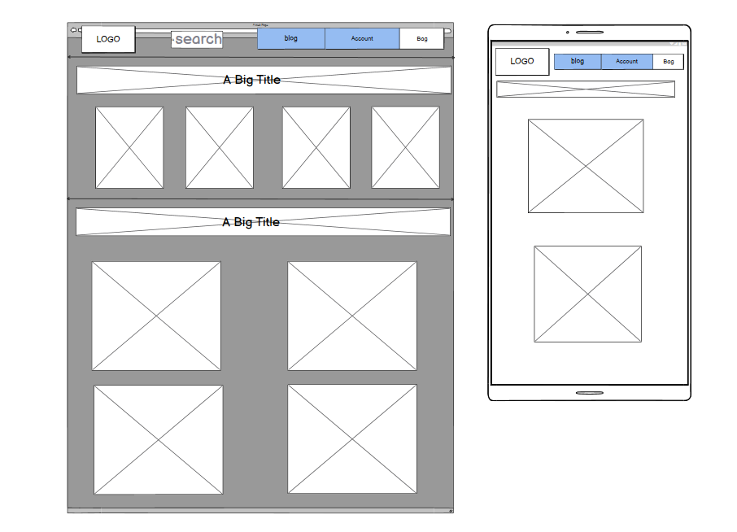

# Paper Weight

[Link to deployed site](https://paper-weight.herokuapp.com/)

## Introduction

Paper Weight is a full-stack Django website built using Python, Javascript, HTML and CSS. This web application is a full B2C e-commerce website for a fictional online stationery store. 

The site provides role based permissions for users to interact with a central dataset. It includes user authentication, email validation, full CRUD functionality for both users and admin users.

The users of the site can browse all products at once, filter specfic categories and search for a specific item. The search bar uses keyword searches so it will show the user a product if the desicription contains the word they were searching.

When a user finds a product that they want, they are able to click on the product image which will direct them to a page on the site which gives them more detail about the specific problem. They can decide to add it into their bag, with the ability of picking the quantity of the item or simply return to all the products. If the user decides later on that they want to change the quantity of the product they have selected they can either change it on the product detail page of from their shopping bag. 

At the checkout, the user will be prompted with a form in order to complete their transaction. If they are an authenticated user then they have an option to save their delivery info for more efficient future checkouts. The user can access any information they have submitted by going to their profile and from their they can update any incorrect information. When the purchase has successfully gone through, the user will recieve a email confirming their purchase, they will also recieve confirmation on the website and are able to see an order history on the profile page.

The payment system uses Stripe. (Please note this website is for eductional purposes only and the credit card payment functionality is not set up to take real payments.) When testing interactively, using the numbers 4242... for everyting will allow the payment to go through as it is a practice card.

## Ideal User Demographic 

### The ideal users of this website are:
- Gift givers
- Kids going back to school 
- Aspiring Artists
- People who are supplying at school/office etc. with stationery

#### Target Audience
- Demographics:
    - Children
    - Artists 
    - Office workers 
    - School teachers

## User Experience

### User Stories 

22 user stories were created while planning this project and out of those, 20 of them were completed (The other 2 that wasn't completed was either due to running out of time or my project changed as it developed and that user story was no longer needed).

As a **Site User** :

- Register for an account so that log in, get and modify my profile and see my orders.
-  Log in and out so that I can access my personal information, shop, and keep my details secure.
- Reset my password so that I can keep my account secure and regain access to my account if I forgot the password.
- Receive a confirmation email when registering so that I can verify my registration to the site was successful.
- Access a specific product so that I can review the details and price.
- Have a shopping bag so that I can see how much my selected products come to.
- Access my profile details so that I can see what personal information is stored.
- Change any details on my profile so that I can keep my personal information up to date.
- Easily access my order history so that I am aware of past purchases.
- Decide whether I want to opt-in for emails from the website so that I can change mind if I change my mind
- Add items I like to a shopping bag so that purchase multiple items at once.
- View a list of products so that I can see what products I want to buy.
- Save my card details so that it helps make future purchases easier.
- Categorise my searches so that I can find products suited better to my needs.
- Search for products so that I can easily access a specific product with ease.
- Make secure products so that safely order and receive any products I choose to buy.
- See reviews that other customers have left so that find out about the quality of a product before purchasing. (Not other customers as I didn't have time to implement it but the users can see blogs that the Admins have posted and are able to comment on them.)
- Select a size and a quantity of a product so that I can be sure I have enough of that selected product in my bag. (This user story was no longer needed due to my project changing direction of what it would sell.)
- Leave a review on a product so that I can voice my opinion on the product for other users to see. (I ran out of time to implement this one. This would be something I would work on in the future.)

As an **Admin**:
- Access a specific product so that I can review the details and price.
-  Alter the details of products so that I can keep the information up to date
- Select what type of products I want to sell so that provide more choices for my customers.
- Add/remove products so that I can change the products I am selling to my customers.
- Search for products so that I can easily access a specific product with ease.

#### Overall Project Goals 
- To provide users different functionalities, such as product purchase and user authentication with secure payments.
- The site owner to have the ability to manage the site to update products and keep users updated on what is going on with the store through the use of blogs.

## Website Architecture 

A relational database has been used to deliver the expected functionality. SQLite was used in development of the site and Postgres provided by the Heroku platform is being used in production. I have created a diagram which shows the database models and the relationships between them. 

As well as creating similar models to the boutique ado walkthrough project provided to us by Code Institute, we were required to make custom models. I created Post, Comment and Contact.

The Post model is responsible for handling the fields of each blog post, the Comment model is responsible for the fields for each comment. The Contact model is repsponsible for handling the submission form that users can do if they need to contact the site owners.

## Wireframes 

My end product of the website wasn't altered much from my initial designs. The checkout and products pages are heavily inspired by the boutique ado project with a few altercations. My home page is full of colour. this site targets a wide range of ages but speficially it is more aimed at children so the bursts of colour on the home page is necessary. 

### Index wireframes

The index page greets users with featured products chosen by the site owners. As they scroll down they come across another section of the website which is divided into 4 groups: All products, pens, paper and school supplies. The user may click on them and it will navigate them to that specific group of products.

### Products wireframe

The products page is quite simple. It features rows and rows of products which users can categorize and narrow down their searches. The site owner can edit and delete products from this page as well.  

### Checkout wireframe

The checkout page is again very simple which helps for an easy and efficient checkout. Th product images are featured on the left hand side and all the information about the product, the quantity and the total on the product/s are to the right of the images. On the bottom right shows the delivery charges and the total charges overall.